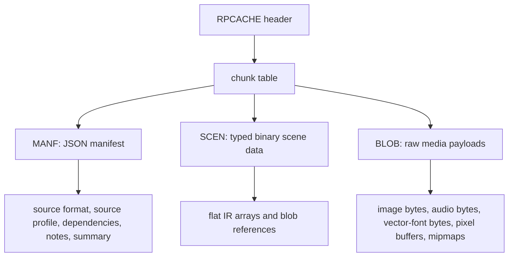

The RavenPorter cache format is a container with a small header, a chunk table, and three required chunks.

## Container Layout

## Chunks

| Chunk | Purpose |
| --- | --- |
| `MANF` | JSON manifest with provenance and summary data |
| `SCEN` | Binary scene encoding for the typed IR structure |
| `BLOB` | Raw media payload store referenced from `SCEN` |

The current cache format version in this repository is `1`.

Existing cooked caches from older commits should be treated as disposable and fully rebuilt after serializer layout changes. This branch keeps the container version at `1`, so older caches are not supported through compatibility shims.

## Read Model

- `MANF` and `SCEN` are loaded eagerly.
- `BLOB` can stay reader-backed and lazy.
- `WithEagerMedia()` forces blob materialization at open time.
- `(*cache.Asset).Close()` releases any reader-backed storage held by lazy blob access.

## What Gets Stored

- flat IR arrays
- material extensions
- manifest summary and dependencies
- compressed image bytes
- audio compressed bytes
- vector-font raw bytes
- optional decoded image pixels and mipmaps

## Intentional Limits

- node `Extras` are dropped in cache v1
- external texture file references are rejected by `cache.Write()`
- whole-file compression is not used

## Why The Split Exists

Separating metadata, scene structure, and raw payloads lets RavenPorter:

- validate chunk bounds before allocation
- keep scene metadata eager
- keep heavy media lazy by default
- restore decode callbacks after read for supported image and audio formats
