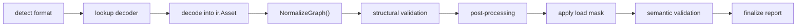

The public root package wraps a fixed internal pipeline. Understanding that order helps explain where report issues come from and why some validations are fatal while others are only recorded.

## Pipeline Order

## Stage Semantics

1. Detection identifies the source format and selects a decoder from the current registry.
2. Decode produces an `ir.Asset` and collects dependency and provenance notes.
3. `NormalizeGraph()` stabilizes root lists and parent links before validation.
4. Structural validation checks bounds, NaN/Inf positions, node references, and other pre-processing integrity rules.
5. Processing applies the configured process-step mask and normalizes the graph after each step.
6. Load-mask pruning removes unwanted domains if `WithLoadMask()` was requested.
7. Semantic validation checks logical correctness such as orphan materials, out-of-range PBR values, texture-reference bounds, and animation NaNs.
8. Report finalization copies metadata, summary counts, dependencies, and notes into the final `Result`.

## Error Behavior

- Detection, decode, structural validation, and processing failures can return an import error.
- Semantic validation appends issues to the report and does not independently fail the import.

## Batch Imports

`ImportDir()` and `ImportFSDir()` first collect supported files, then run them through the same single-asset pipeline in parallel. By default the worker limit is `runtime.GOMAXPROCS(0)`, and you can override it with `WithBatchConcurrency()`.

## Public Consequence

This pipeline is not the public API surface. The stable integration point is still the root package. Understanding the pipeline mainly helps when you are interpreting reports, validation behavior, and extension hooks.
